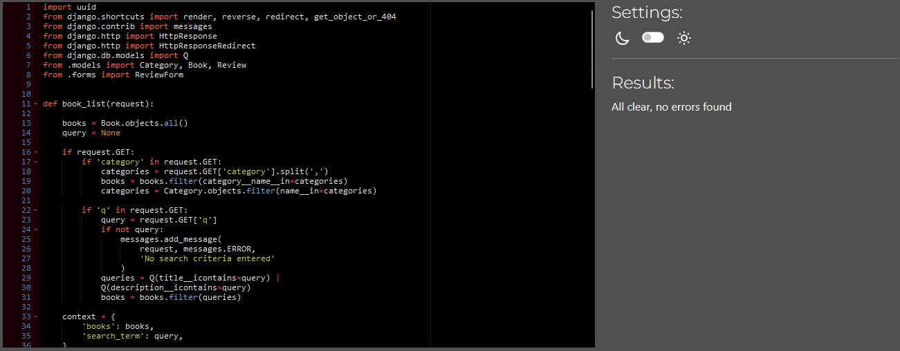
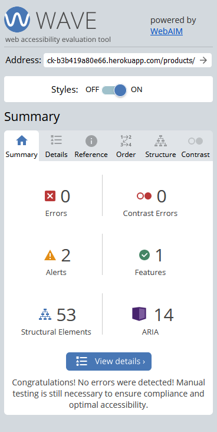

# Tomeshack
- developed by Arthur Ambalov

## Table of Contents

1. [Overview](#overview)
2. [User Stories](#user-stories)
    1. [Tracking](#tracking)
3. [Design](#design)
    1. [Colour](#colour)
    2. [Font](#font)
    3. [Database](#database)
4. [Features](#features)
    1. [Pages](#pages)
5. [Validation](#validation-and-testing)
    1. [HTML](#html)
    2. [CSS](#css)
    3. [Javascript](#javascript)
    4. [Python](#python)
    5. [Accessibility](#accessibility)
    6. [Performance](#performance)
    7. [Browser Compatibility](#browser-compatibility)
    8. [Device Compatibility](#device-compatibility)
    9. [User Stories](#user-stories)
    10. [Automated Testing](#automated-testing)
6. [Bugs](#bugs)
7. [Deployment](#deployment)
8. [Credits](#credits)

## Overview

Tomeshack is an online bookshop where people can browse different categories of books, purchase hard copies to be delivered to them and leave reviews on the books for sale.

## User Stories
The website is designed for 8 detailed user stories, which are detailed alongside their acceptance criteria:

1. As a customer I can view a sortable list of books so that I can search for the kinds of book I am interested in.
Acceptance criteria:
- A products page displays a list of books
- Books are shown with titles, ratings, prices and excerpts of descriptions
- The list can be filtered by different categories

2. As a customer I can view or leave reviews so that I can see what people think of the books and share my thoughts.
Acceptance criteria:
- On a book's individual page, a review section is added
- Reviews appear in sequence for others to read
- Logged-in users can write reviews for others

3. As a customer I can view a detailed info page for a book so that I can read more on it.
Acceptance criteria:
- When a book's card is clicked in the main view, user is brought to its dedicated page
- This page allows for a full reading of the book's description
- The book's price and Tomeshack rating are shown

4. As a site administrator I can hide or delete reviews so that I can moderate harmful or hostile content.
Acceptance criteria:
- As a superuser viewing a book's dedicated page, a hide and delete button appear on reviews
- Hidden reviews are only visible to superusers
- Deleted posts are removed from the database entirely

5. As a customer I can add books I want to buy to my cart so that I can purchase them in a convenient manner.
Acceptance criteria:
- Viewing a book's dedicated page allows the user to add one or more copies to their cart
- Copies have a maximum of 4 in the cart to avoid scalping
- Cart items are saved to the session

6. As a customer I can view and modify my cart so that I can make final adjustments before ordering.
Acceptance criteria:
- The cart can be viewed on its own dedicated page with all products visible
- Product quantities can be modified directly from the cart page
- Items can be removed from the cart from the page

7. As a customer I can search the site for a book by title so that I can more easily find what I'm looking for.
Acceptance criteria:
- On the navbar, a search bar is visible
- Keywords can be entered into the search bar
- Searching shows only books with the keywords in their title or description

8. As a customer I can sign up to a newsletter so that I can stay up to date on new book deals.
Acceptance criteria:
- On the main page, a signup form is available
- Customers can subscribe to the newsletter
- Subscribers receive information on new deals

### Tracking

In accordance with agile principles, the user stories were tracked using GitHub's projects and issues features to create a kanban board. The project is set to visible, and a screenshot of it is shown below:

Image

## Design
A few wireframes were made in advance of starting development to plan out the most important features and the structure of code that would be required to accompany them.

The wireframes are presented below:

### Colour
Using <a href="https://mycolor.space">ColorSpace</a> a colour scheme was picked using blue shades to give the site a nice relaxing feeling appropriate for a place about stories and reading.

### Font
Open Sans was used as an easy and readable font to use throughout the site for most text. Oswald is used as an alternative to help make headings stand out.

### Search Engine Optimisation
Meta tags, a robots.txt file and a sitemap were all included in the project to optimise SEO quality.

### Database
- The website's backend database is powered by the Django framework, with the PostgresSQL relational database system provided by Code Institute.

The following models are used:

#### Category

The Category model is used to record the different categories that books are sorted by.

The category model contains:
- An internal name used for code
- A human-readable code for easier admin usage

#### Book

The Book model is used to record individual books for sale.

The book model contains:
- The category, a foreign key of the above Category model
- A unique slug ID to be defined for each book
- The title of the book as a string
- The description of the book as a string
- The book's price
- Tomeshack's rating for the book (out of 5)

#### Review

The review model is used for the reviews users can leave on books. It has the following fields:
- The review's author, a built-in Django User model
- A unique ID automatically generated for new reviews
- The book being reviewed (as in the above Book model)
- The text content of the review (capped to 200 characters)
- Whether a site administrator has hidden the review

#### Orders

The order model is used to track customer orders, with the following fields:
- A randomly generated order number
- The customer's full name
- Their email
- Their phone number
- The country they live in
- Their postcode (optional)
- Their town or city
- Their street address (in two lines)
- Their county (optional)
- The date and time the order was placed
- The total value of the order

#### Order Lines

The individual lines of an order are stored as a model with the following fields:
- The order the line is associated with (as Order model above)
- The book being purchased (as Book model above)
- The quantity of copies expressed as an integer
- The automatically-calculated total value of the line

## Features
The website has 5 main pages and X features across them.

### Pages
The 5 pages are:

- The homepage, which welcomes the customer, has a button to go to the products page and has a newsletter signup form.
- The products page, where books are displayed and can be filtered using the categories at the top or via the searchbar
- The book view page, where details of a book can be seen and reviews created or read
- The cart page, where a user can see and modify their cart and proceed to checkout
- The checkout page, where a user can enter their details to confirm their order

### Navbar
The navbar at the top of all pages has several buttons used to travel between the homepage, products page, cart and accounts pages.
User stories fulfilled: 7

Image

### Searchbar
A searchbar can be used to find specific books or description keywords. Submitting a query sends a user to the products page with only books that have the entered query in their title or description.
User stories fulfilled: 7

Image

### Newsletter
A newsletter signup via Mailchimp is available on the front page to allow users to subscribe to emails containing new deals.
User stories fulfilled: 8

Image

### Sorting Categories
Several sort options are available on the products page to sort the list via sets of genres.
User stories fulfilled: 1

Image

### Book List
The books (sortable via the sorting categories or searchbar) are listed on the products page with a description excerpt, price and rating.
User stories fulfilled: 1, 7

Image

### Detailed View
Full descriptions of a book can be seen on their dedicated page.
User stories fulfilled: 3

Image

### Quantity Selectors
These buttons on a book's detailed view can be used to select up to 4 total copies to be added to the cart.
User stories fulfilled: 5

Image

### Reviews
A reviews section under each book allows users to see reviews left by others or to leave their own if logged in.
User stories fulfilled: 2, 4

Image

### Cart
The cart page shows a list of all products in the cart, quantities and subtotals alongside a grand total, and quantities can be managed or products removed via this page.
User stories fulfilled: 6

Image

## Validation and Testing

### HTML
All pages on the site are validated with the W3C's Markup Validation Service and show no errors or warnings. See each page below:

Homepage

Products Page

Detailed View

Cart

Checkout

### CSS
The CSS style used by the site was validated with the W3C's CSS Validation Service, and showed no errors. There is one warning for the external stylesheet of Google Fonts which cannot be checked. See below:

Images

### JavaScript
The JavaScript code used for Stripe payment processing was run through the JSHint Javascript validator. There are no errors besides those caused by the unique tokens $ and Stripe tokens used by jQuery and Stripe libraries respectively.

Image

### Python
<a href="https://pep8ci.herokuapp.com/">PEP8 Python Linter</a> was used to validate python files.

#### Home App ####

urls.py

views.py

#### Cart App ####

contexts.py

test_views.py

urls.py

views.py

#### Checkout App ####

admin.py

apps.py

forms.py

models.py

signals.py

urls.py

views.py

webhook_handler.py

webhooks.py

#### Products App ####

admin.py

forms.py

models.py

test_forms.py

test_views.py

urls.py

views.py

### Accessibility
Pages on the site are checked with the WAVE Website Accessibility Evaluation Tool. One error on the main page is from MailChimp's signup form, which is intentionally present to avoid bot signups. Other pages have no errors. See each page below:

Main Page

Products

Detailed View

Cart

### Browser Compatibility
Each page has been tested to work on:
- Mozilla Firefox
- Google Chrome
- Microsoft Edge

### Device Compatibility
Each page was tested on Mozilla Firefox and Google Chrome's developer tools for responsive design. Testing was done on a desktop PC running Windows 11 and a Galaxy A50 phone.

### User Stories
Below is a list of user stories and the process by which they are fulfilled:

### Automated Testing
Automated tests were created to test the forms and views of apps where relevant.

Image

## Bugs
Notable bugs found during development:

- The behaviour of the increment and decrement buttons was found to be very unreliable during testing, sometimes resulting in attempts to decrement the quantity of an item instead doubling it. This was fixed by adjusting the imported Bootstrap and jQuery versions to ones I knew were compatible with each other, which fixed the issue.

## Deployment
The project was deployed using the online platform Heroku. The following steps were taken:

1. Log in or sign up to the Heroku website:

Image

2. Click the "new" button and then "Create a new app"

Images

3. Choose an app name and region to use, Europe in my case

Image

4. Navigate to the "Settings" tab of the new app and set the config vars: the postgres database URL and the secret key it uses:

Image

5. Go to the "Deploy" page and select GitHub as a deploy method, log in via GitHub and then select the desired repository

Image

6. Go to "Manual deploy", make sure the main branch is selected, and click "Deploy"

Image

### Forking
On this project's repository, at the upper-right-hand side, there is a "fork" button to create a fork of it.

### Cloning
On this project's repository, at the upper-right-hand side, there is a "Code" button. To clone the project, click the button and:
- Choose between HTTPS, SSH or GitHub CLI as preferred and click the "Copy url to clipboard" button
- Open Git Bash
- Set the working directory to where the cloned project should be
- Type "git clone " followed by the copied URL
- Hit enter to create the cloned project

## Credits
- Icons: <a href="https://fontawesome.com/icons">FontAwesome</a>
- Original dataset: <a href="https://www.kaggle.com/datasets/bishop36/bookstore">bookstore by Bishop36 on Kaggle</a>, modified for usage in this project

Technology used:
- Languages: HTML 5, CSS, JavaScript, Python
- Database management framework: Django
- IDE: GitPod
- Version control: GitHub
- Deployment: Heroku
- Wireframing: Balsamiq
- Validation: W3C HTML Validator, W3C CSS Validator, JSHints Code Quality Tool, WAVE Website Accessibility Evaluation Tool, PEP8, Google Chrome
- Color palette design: <a href="https://mycolor.space">ColorSpace</a>

### Third Party Libraries

- Bootstrap 4 was used for its easy and powerful HTML, CSS and Javascript functions to improve the site's appearance and functionality.
- Django AllAuth is used for its login/signup/logout functions alongside the base Django user features.
- Django Crispyforms is installed to create the forms that users can use to create posts or submit feedback to the admins.
- WhiteNoise is used to allow Django to serve static files such as CSS to deployment apps such as Heroku, necessary so that the site can be styled without having a CDN.

Other:
- Code Institute for walkthrough on cart and checkout code
- Mo Shami for mentoring, guidance and feedback