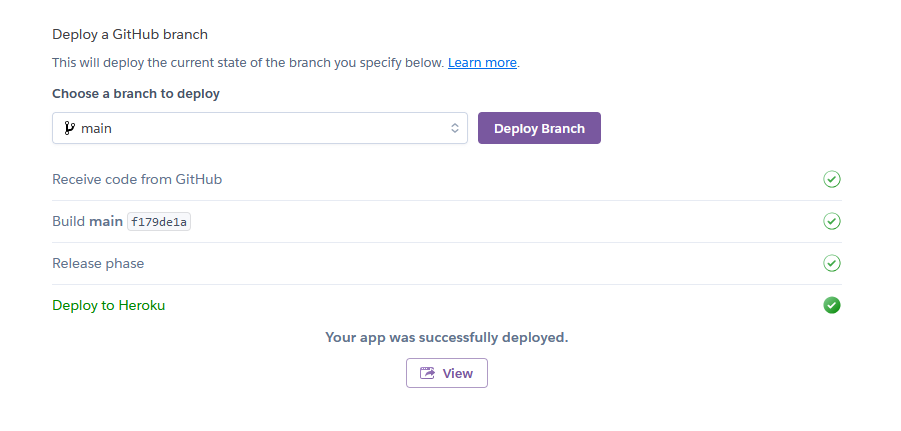

# Tomeshack
- developed by Arthur Ambalov

## Table of Contents

1. [Overview](#overview)
2. [User Stories](#user-stories)
    1. [Tracking](#tracking)
3. [Design](#design)
    1. [Colour](#colour)
    2. [Font](#font)
    3. [Database](#database)
4. [Features](#features)
    1. [Pages](#pages)
5. [Validation](#validation-and-testing)
    1. [HTML](#html)
    2. [CSS](#css)
    3. [Javascript](#javascript)
    4. [Python](#python)
    5. [Accessibility](#accessibility)
    6. [Performance](#performance)
    7. [Browser Compatibility](#browser-compatibility)
    8. [Device Compatibility](#device-compatibility)
    9. [User Stories](#user-stories)
    10. [Automated Testing](#automated-testing)
6. [Bugs](#bugs)
7. [Deployment](#deployment)
8. [Credits](#credits)

## Overview

Tomeshack is an online bookshop where people can browse different categories of books, purchase hard copies to be delivered to them and leave reviews on the books for sale.

## User Stories
The website is designed for 8 detailed user stories, which are detailed alongside their acceptance criteria:

### Tracking

In accordance with agile principles, the user stories were tracked using GitHub's projects and issues features to create a kanban board. The project is set to visible, and a screenshot of it is shown below:

Image

## Design
A few wireframes were made in advance of starting development to plan out the most important features and the structure of code that would be required to accompany them.

The wireframes are presented below:

### Colour
Using <a href="https://mycolor.space">ColorSpace</a> a colour scheme was picked using blue shades to give the site a nice relaxing feeling appropriate for a place about stories and reading.

### Font
Open Sans was used as an easy and readable font to use throughout the site for most text. Oswald is used as an alternative to help make headings stand out.

### Database
- The website's backend database is powered by the Django framework, with the PostgresSQL relational database system provided by Code Institute.

The following models are used:

#### Category

The Category model is used to record the different categories that books are sorted by.

The category model contains:
- An internal name used for code
- A human-readable code for easier admin usage

#### Book

The Book model is used to record individual books for sale.

The book model contains:
- The category, a foreign key of the above Category model
- A unique slug ID to be defined for each book
- The title of the book as a string
- The description of the book as a string
- The book's price
- Tomeshack's rating for the book (out of 5)

#### Review

The review model is used for the reviews users can leave on books. It has the following fields:
- The review's author, a built-in Django User model
- A unique ID automatically generated for new reviews
- The book being reviewed (as in the above Book model)
- The text content of the review (capped to 200 characters)
- Whether a site administrator has hidden the review

## Features
The website has 5 main pages and X features across them.

## Validation and Testing

### HTML
All pages on the site are validated with the W3C's Markup Validation Service and show no errors or warnings. See each page below:

### CSS
The CSS style used by the site was validated with the W3C's CSS Validation Service, and showed no errors. There is one warning for the external stylesheet of Google Fonts which cannot be checked. See below:

### JavaScript
The JavaScript code used for the post deletion modal was validated with the JSHint Code Quality Tool, showing no errors or warnings.

### Python

#### Cart App ####

#### Checkout App ####

#### Products App ####

### Accessibility
All pages on the site are checked with the WAVE Website Accessibility Evaluation Tool, and none show any errors. See each page below:

### Performance
Google Chrome's Lighthouse feature was used to check every page for performance issues, and each returned a high score in all categories. See each page's result below:

### Browser Compatibility
Each page has been tested to work on:
- Mozilla Firefox
- Google Chrome
- Microsoft Edge

### Device Compatibility
Each page was tested on Mozilla Firefox and Google Chrome's developer tools for responsive design. Testing was done on a desktop PC running Windows 11 and a Galaxy A50 phone.

### User Stories
Below is a list of user stories and the process by which they are fulfilled:

### Automated Testing
Automated tests were created to test the forms and views of apps where relevant (there are no forms in the products app)

#### Cart App ####

#### Contact App ####

#### Products App ####

## Bugs
Notable bugs found during development:

- The behaviour of the increment and decrement buttons was found to be very unreliable during testing, sometimes resulting in attempts to decrement the quantity of an item instead doubling it. This was fixed by adjusting the imported Bootstrap and jQuery versions to ones I knew were compatible with each other, which fixed the issue.

## Deployment
The project was deployed using the online platform Heroku. The following steps were taken:

1. Log in or sign up to the Heroku website:

Image

2. Click the "new" button and then "Create a new app"

Images

3. Choose an app name and region to use, Europe in my case

Image

4. Navigate to the "Settings" tab of the new app and set the config vars: the postgres database URL and the secret key it uses:

Image

5. Go to the "Deploy" page and select GitHub as a deploy method, log in via GitHub and then select the desired repository

Image

6. Go to "Manual deploy", make sure the main branch is selected, and click "Deploy"

Image

### Forking
On this project's repository, at the upper-right-hand side, there is a "fork" button to create a fork of it.

### Cloning
On this project's repository, at the upper-right-hand side, there is a "Code" button. To clone the project, click the button and:
- Choose between HTTPS, SSH or GitHub CLI as preferred and click the "Copy url to clipboard" button
- Open Git Bash
- Set the working directory to where the cloned project should be
- Type "git clone " followed by the copied URL
- Hit enter to create the cloned project

## Credits
- Icons: <a href="https://fontawesome.com/icons">FontAwesome</a>

Technology used:
- Languages: HTML 5, CSS, JavaScript, Python
- Database management framework: Django
- IDE: GitPod
- Version control: GitHub
- Deployment: Heroku
- Wireframing: Balsamiq
- Validation: W3C HTML Validator, W3C CSS Validator, JSHints Code Quality Tool, WAVE Website Accessibility Evaluation Tool, PEP8, Google Chrome
- Color palette design: <a href="https://mycolor.space">ColorSpace</a>

### Third Party Libraries

- Bootstrap 4 was used for its easy and powerful HTML, CSS and Javascript functions to improve the site's appearance and functionality.
- Django AllAuth is used for its login/signup/logout functions alongside the base Django user features.
- Django Crispyforms is installed to create the forms that users can use to create posts or submit feedback to the admins.
- WhiteNoise is used to allow Django to serve static files such as CSS to deployment apps such as Heroku, necessary so that the site can be styled without having a CDN.

Other:
- Code Institute for walkthrough on cart and checkout code
- Mo Shami for mentoring, guidance and feedback